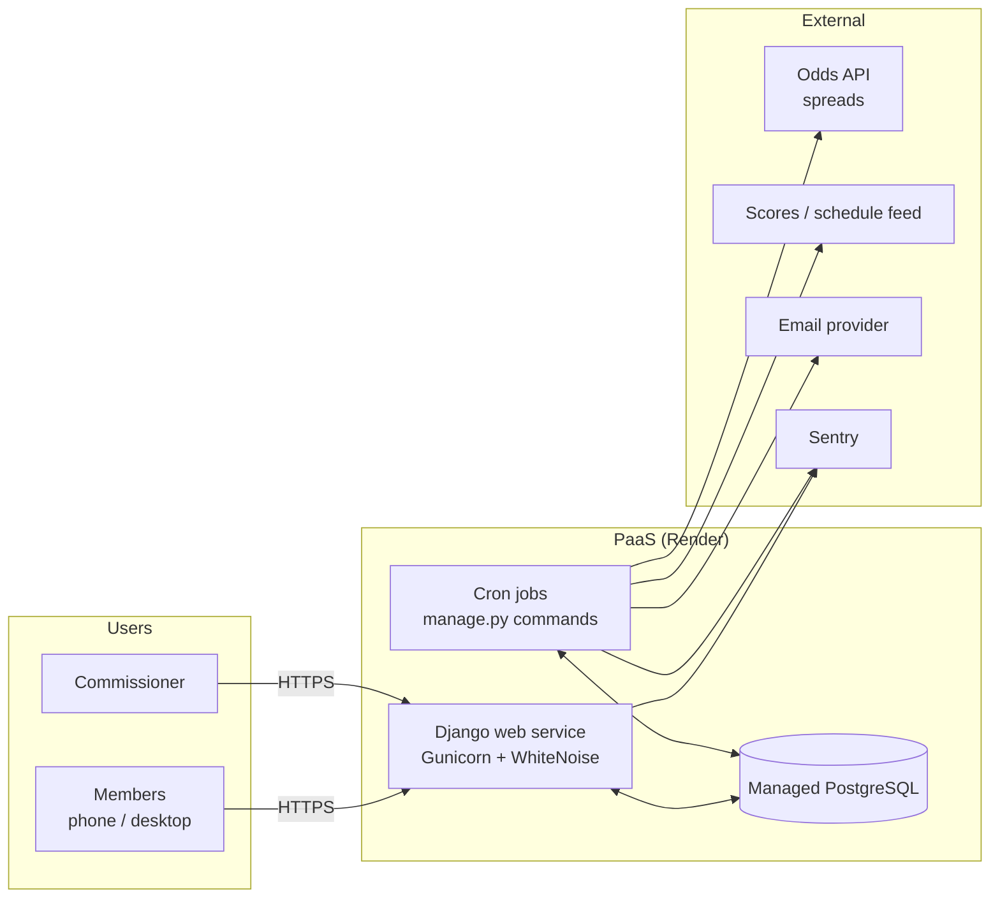

# 03 — Architecture & Hosting

## 1. System overview

A single Django monolith, one Postgres database, and a few cron-triggered jobs that talk to
external data feeds.



## 2. Weekly lifecycle

Times are Pacific and configurable per league season. All storage is UTC.

```mermaid
sequenceDiagram
    autonumber
    participant Cron
    participant App
    participant Feeds as Odds/Scores feeds
    participant Members
    participant Comm as Commissioner

    Note over Cron,App: Tuesday 3:00 AM PT — spread lock (configurable)
    Cron->>Feeds: fetch current spreads for week N
    Cron->>App: normalize to half points, snapshot, mark week N "published"
    App-->>Comm: email: lines locked (review/override link)
    App-->>Members: email: week N is open for picks

    Note over Members,App: Tue–Sun — picking window
    Members->>App: make / edit picks, best bet, tiebreaker guess
    App->>App: reject edits to games past their lock time

    Note over App: Thu/Fri/Sat & early-Sunday games lock at their own kickoff
    Note over App: Sunday 10:00 AM PT — everything else locks

    Note over Cron,App: Thu PM & Sun ~8 AM PT — reminders
    Cron->>App: send_reminders (members with unpicked open games)

    Note over Cron,Feeds: Game windows — every 5 min
    Cron->>Feeds: fetch scores/status
    Cron->>App: update games; grade finals

    Note over App: After Monday night final
    App->>App: week N final → weekly winner(s) (tiebreaker guess, then split)
```

### Game/week state machines

**Week**: `scheduled → published (spreads locked, picks open) → in_progress (first kickoff passed) → final (all games final/graded)`

**Game**: `scheduled → in_progress → final` (plus `postponed` / `cancelled`). A postponed game keeps its week; the week stays open (provisional) until it is final.
A game's picks lock when `now >= min(kickoff_at − offset, week.picks_lock_at)` (see
[01 §2.2](01-product-requirements.md)), evaluated server-side on every write — not by a job.
That way a late or missed cron run can never leave a game unlocked.

## 3. Scheduled jobs

| Job | Schedule | Purpose |
|-----|----------|---------|
| `sync_schedule` | Daily 05:00 PT (in-season) | Pull schedule; catch kickoff time changes / flex scheduling |
| `lock_spreads` | Every 15 min; acts once `now >= week.spreads_lock_at` (default Tue 3:00 AM PT) | Fetch lines, normalize to half points, snapshot as the week's locked spreads |
| `refresh_lines` | Every 2 h Tue–Sun, plus at each game's lock | Only when needed: current lines for `variable` mode, `closing` snapshots for closing mode, and filling OFF lines once posted. A no-op for the default fixed-at-lock mode with no OFF games. |
| `sync_scores` | Every 5 min (cheap no-op outside game windows) | Update scores/status; grade finals |
| `send_reminders` | Every 15 min; sends at the league's configured `reminder_times` (default Thu 12:00, Sun 08:00 PT) | Email members with unpicked open games, a missing best bet, or a missing tiebreaker guess |
| `apply_autopicks` | At each game's lock (Later phase) | Fill missed picks when `autopick` is enabled and the member has weeks remaining |
| `healthcheck` | Hourly | Alert if the current week has no locked spreads past lock time, or games stuck "in progress" |

Because lock and reminder times are league settings ([08](08-league-settings.md)), the jobs run on
a fixed short interval and check the configured times themselves; changing a setting never requires
editing cron config. All jobs are idempotent. `sync_scores` decides internally whether any game is live or recently
ended, so a single every-5-minutes cron entry is enough.

## 4. Hosting

### Recommendation: Render

| Component | Render service | Approx. cost / month |
|-----------|----------------|----------------------|
| Web app | Web Service (Starter) | ~$7 |
| Database | Postgres (Basic, smallest) | ~$6–7 |
| Cron jobs | Cron Job services | ~$1 each (billed per minute run) |
| TLS, custom domain | Included | $0 |
| **Total** | | **≈ $15–20** |

*(Verify current pricing before committing.)*

Why Render: git-push deploys, managed Postgres with daily backups, first-class cron jobs that
reuse the same build, no servers to patch. Everything is declared in a `render.yaml` blueprint
checked into the repo.

### Alternatives

| Option | Pros | Cons |
|--------|------|------|
| **Railway** | Very similar DX; usage-based pricing can be cheaper | Cron is less explicit; costs can drift |
| **Fly.io** | Cheap, fast, close to users | More ops knobs; Postgres setup more hands-on |
| **Single VPS** (Hetzner/DigitalOcean) + Docker Compose + Caddy | ~$5/mo, full control | You own OS patches, backups, uptime |
| **PythonAnywhere** | Very simple Django hosting | Limited scheduled tasks/outbound API on cheap tiers |

Everything is containerizable (a `Dockerfile` is the portable unit), so moving hosts later is easy.

## 5. Environments

| Env | Where | Notes |
|-----|-------|-------|
| Local | Your machine, `uv run manage.py runserver`, Postgres via Docker | Seeded with a fake season; `time-machine` for testing locks |
| Production | Render | Auto-deploy on merge to `main` after CI passes |

A separate staging environment is probably unnecessary; a "test league" inside production
plus a solid test suite should be enough. Revisit if needed.

## 6. Security & reliability

- HTTPS only, secure cookies, Django CSRF protection (HTMX configured to send the token).
- Secrets (API keys, DB URL, email key) in host environment variables, never in git.
- Picks of other members are **never sent to the browser** before the game locks (enforced in
  queries, not just hidden in templates).
- Lock checks use the database server's clock / timezone-aware `django.utils.timezone.now()`.
- Daily managed DB backups; plus a weekly `pg_dump` export retained off-platform (cheap insurance).
- Sentry for errors in web and cron; an uptime monitor (e.g., UptimeRobot / Healthchecks.io)
  pings the site and receives a heartbeat from cron jobs.
- Rate limiting on login (allauth has this built in).
