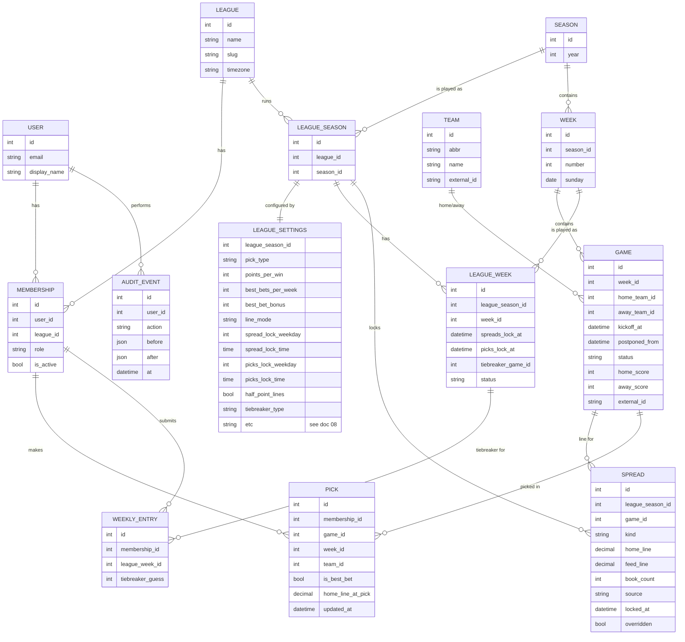

# 04 — Data Model

## 1. Entity diagram



**Global NFL data** (`Season`, `Week`, `Team`, `Game`) is shared by all leagues and filled in by the
feed sync jobs.

**League-specific data** (`LeagueSeason`, `LeagueSettings`, `LeagueWeek`, `Spread`) hangs off the
league, because lock times and line settings are configurable per league. Two leagues that lock at
different times would lock different lines.

## 2. Key fields and constraints

### LeagueSettings
A typed model, one-to-one with `LeagueSeason`, with one column per setting. The full catalog,
defaults and mid-season change rules are in [08 League Settings](08-league-settings.md). Times are
interpreted in `league.timezone` (default `America/Los_Angeles`, DST-aware).

### LeagueWeek — the concrete schedule for one week
- `spreads_lock_at`, `picks_lock_at` — UTC datetimes **computed** from `LeagueSettings`
  when the week is created (e.g., the Tuesday before `week.sunday` at 12:00 PT, and `week.sunday`
  at 10:00 PT). Stored, so the commissioner can **override a single week** (holiday weeks, etc.)
  without changing the season defaults.
- `tiebreaker_game` — the game whose total points (or margin, per `tiebreaker_type`) decide weekly
  ties. With `tiebreaker_game = last_game_of_week` (default) it's the **last game of the week
  by kickoff** (the later game on a Monday doubleheader). Set automatically when the week is
  published and re-checked by `sync_schedule` if kickoff times change, **until `picks_lock_at`**.
  After that it is frozen: if a game is postponed later, it must not become (or stop being) the
  tiebreaker game. The commissioner can override it (audited).
- `status` — `scheduled → published → in_progress → final`. A week becomes `final` only when
  **every** game in it is final, so a postponed game holds the week (and its weekly prize) open.
  The UI shows such a week as "provisional".

### Game
- `kickoff_at` — timezone-aware UTC datetime.
- `status` — `scheduled | in_progress | final | postponed | cancelled`.
- A postponed game keeps its `week` and gets a new `kickoff_at` when it's rescheduled. Its
  **lock time does not move**. When `sync_schedule` first sees a game postponed, it saves the
  previous kickoff in `postponed_from`, and the lock uses that. Ordinary schedule changes before
  lock (flexing, a Saturday game added) don't set `postponed_from`, so they move the lock normally.
- `external_id` — ID in the schedule/score feed, for idempotent upserts.

**Lock time (derived, never stored):**
```python
def lock_at(game, league_week, settings) -> datetime:
    kickoff = game.postponed_from or game.kickoff_at   # postponement never reopens picks
    game_lock = kickoff - timedelta(minutes=settings.game_lock_offset_minutes)
    return min(game_lock, league_week.picks_lock_at)
```

### Spread
- Unique `(league_season, game, kind)`.
- `kind` — `locked` (snapshot at spread lock; used by `line_mode = fixed_at_lock`) or `closing`
  (snapshot at the game's lock; used by `line_mode = closing`). In `variable` mode the line is stored
  on each pick instead (see Pick).
- `home_line` — the line from the **home team's perspective** (e.g., `-3.5` = home favored by 3.5).
  The away line is always `-home_line`. Storing one number avoids inconsistent pairs.
  **Nullable**: `null` means the line is **OFF** (no line available). The game is unpickable until a
  line is set, and `off_line_fallback` applies at the game's lock.
- **Half points:** when `half_point_lines` is on (default), the service layer only saves values ending
  in `.5`, so pushes can't happen. Turning it off allows whole numbers and pushes (`push_scoring`).
- `feed_line` — the raw value from the feed before half-point normalization (may be whole), kept for transparency.
- `source` — `the-odds-api:median`, or `manual`. `book_count` — how many sportsbooks went into the median.
- `overridden` — true if the commissioner changed it; the before/after is recorded in `AuditEvent`.

### Pick
- Unique `(membership, game)` — one pick per member per game.
- **Best bets per member per week ≤ `best_bets_per_week`** (default 1). Because the limit is a
  setting, it's enforced in the service layer inside a transaction that locks the member's
  `WeeklyEntry` row (`select_for_update`), so two simultaneous taps can't exceed it.
  (`week_id` is denormalized from `Game` to make the count query cheap.)
- `team` must be one of the game's two teams.
- `home_line_at_pick` — the current line when the pick was saved. It's always recorded (useful
  history), but scoring uses it only in `variable` line mode.
- Create/update/delete allowed only while the league week is `published` and `now < lock_at(game)`.
  Moving the best bet requires **both** the old and new games to be unlocked.
- A missing pick is simply **no row**. It earns 0 points and has no effect on prize eligibility.
  Never create placeholder picks for missed games.

### WeeklyEntry
- Unique `(membership, league_week)`.
- `tiebreaker_guess` — non-negative integer (total points, or margin of victory if
  `tiebreaker_type = margin_of_victory`), nullable (missed guess); editable until `league_week.picks_lock_at`.

## 3. Scoring — computed, not stored

Results are derived from `Pick + Game final score + line + LeagueSettings`, never typed in.

```python
def scoring_line(pick, settings) -> Decimal:
    match settings.line_mode:
        case "fixed_at_lock": return spread(pick.game, kind="locked").home_line
        case "closing":       return spread(pick.game, kind="closing").home_line
        case "variable":      return pick.home_line_at_pick

def result(pick, settings) -> Literal["win", "loss", "push", "pending"]:
    game = pick.game
    if game.status != "final":
        return "pending"
    margin = game.home_score - game.away_score          # home team margin
    if settings.pick_type == "against_spread":
        margin += scoring_line(pick, settings)
    if pick.team_id == game.away_team_id:
        margin = -margin
    return "win" if margin > 0 else "loss" if margin < 0 else "push"   # no push with half-point lines

def points(pick, settings) -> Decimal:
    base = settings.points_per_win + (settings.best_bet_bonus if pick.is_best_bet else 0)
    match result(pick, settings):
        case "win":  return base
        case "push": return {"half_points": base / 2, "win": base, "loss": 0}[settings.push_scoring]
        case _:      return 0
```

Points are `Decimal`, not `int`, because a push can be worth half a point when half-point
lines are turned off. Later-phase extras (underdog bonus, exact tiebreaker bonus, over/under,
drop worst week) are added as separate terms in `week_points()`.

**Weekly winner(s)** — returns a *list*, because the prize can be split:

```python
def weekly_winners(league_week) -> list[Membership]:
    totals = {m: week_points(m, league_week) for m in active_members}   # 0 if no picks at all
    best = max(totals.values())
    leaders = [m for m, pts in totals.items() if pts == best]
    if len(leaders) == 1:
        return leaders

    g = league_week.tiebreaker_game
    actual = (g.home_score + g.away_score if settings.tiebreaker_type == "total_points"
              else abs(g.home_score - g.away_score))          # margin_of_victory
    def distance(m):                       # missed guess = infinitely far
        guess = entry_for(m, league_week).tiebreaker_guess
        return abs(guess - actual) if guess is not None else math.inf

    closest = min(distance(m) for m in leaders)
    return [m for m in leaders if distance(m) == closest]   # 2+ → split the prize (not configurable)
```

`week_points` uses the `weekly_prize` metric setting: `points` (default) or `wins`.

Members who missed picks are included like everyone else; missed games just contribute 0.
`weekly_winners` is only final once the league week is `final` (every game played, including any
postponed game). Until then, the same function gives the *provisional* leaders.

**Season prizes** (points champion, best bet champion) work the same way: everyone tied for first
is a winner and they split the prize. There is no tiebreaker.
The weekly results page shows every winner, and a "split N ways" label when there's more than one.

Leaderboards are aggregate SQL queries over picks joined to final games (annotated with a
`CASE` expression for the result). At ~50 members × 272 games ≈ 14k picks per season, this is
trivially fast; no materialized standings table needed. If it ever becomes slow, add a
`WeeklyResult(membership, league_week, correct, best_bet_correct, points)` cache table rebuilt
whenever a game goes final.

## 4. Visibility rule

A member may see another member's pick for a game only once it's revealed. With
`pick_visibility = at_game_lock` (default) that's `now >= lock_at(game)`; with `at_weekly_deadline`
it's `now >= league_week.picks_lock_at`. Other members' tiebreaker guesses are visible only after
`picks_lock_at`. Implemented in single queryset
methods (`Pick.objects.visible_to(user)`, etc.) used by every view, so no template can
accidentally leak picks.
