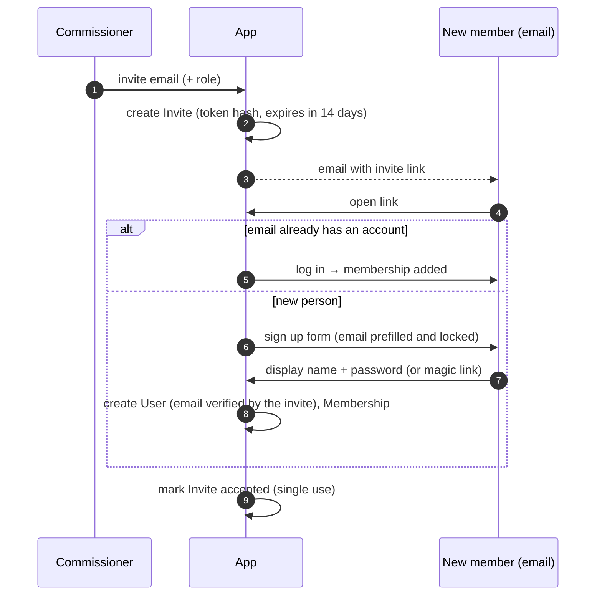

# 09 — User Management

Accounts, authentication, roles and the member lifecycle. The approach follows standard Django
and OWASP / NIST SP 800-63B practice, using **`django-allauth`** for the account flows rather than
building our own.

## 1. Principles
- **Invite-only.** There's no public signup. Every account starts from a commissioner's invite.
- **Use the framework, don't roll our own.** Django auth + allauth handle hashing, tokens, sessions,
  email verification, rate limiting and MFA.
- **Minimal personal data.** Email, display name, timezone and notification preferences only. No
  phone numbers, addresses or payment details.
- **Accounts and league membership are separate.** A `User` is a person; a `Membership` is that
  person's role in a league. Removing someone from a league never deletes their history.

## 2. Accounts

### 2.1 User model
- A **custom user model from day one** (`accounts.User`, subclassing `AbstractUser`). Django
  strongly recommends this because swapping it later is painful.
- **Email is the login identifier**, unique and case-insensitive (stored lowercased, unique index on
  `lower(email)`). There's no separate username.
- Fields: `email`, `display_name` (shown on leaderboards, unique within a league), `timezone`
  (defaults to the league's), `is_active`, `date_joined`, `last_login`.

### 2.2 Login methods
| Method | MVP | Notes |
|--------|-----|-------|
| Email + password | ✅ | Baseline |
| Email "magic link" (one-time login code by email) | ✅ (recommended) | Easiest for infrequent users. allauth "login by code" |
| Google sign-in | Optional | allauth social provider; only links to an existing invited email |
| Passkeys (WebAuthn) | Later | allauth MFA supports passkeys |

The final choice is open question 5 in [06](06-open-questions.md); the design supports all of these.

### 2.3 Passwords (NIST SP 800-63B)
- **Argon2** hashing (`django[argon2]`, `Argon2PasswordHasher` first in `PASSWORD_HASHERS`).
  Existing hashes are upgraded automatically on login.
- Minimum **10 characters**, maximum 128. No forced composition rules or periodic expiry.
- Reject common and breached passwords: Django's `CommonPasswordValidator` plus a **Have I Been
  Pwned** range check (k-anonymity API: only the first 5 characters of the SHA-1 hash leave the
  server). If HIBP is unreachable, the password is allowed.
- Reject passwords too similar to the email or display name (`UserAttributeSimilarityValidator`).
- Changing a password requires the current password and **signs out all other sessions**.

### 2.4 Password reset
- allauth's reset flow: a single-use, time-limited token (1 hour) emailed as a link.
- The response is the same whether or not the email exists, so it can't be used to discover
  which emails have accounts.
- Rate-limited per IP and per email.

### 2.5 Multi-factor authentication
- allauth MFA: **TOTP** authenticator apps and recovery codes; passkeys later.
- **Optional for members**, **required for commissioners and site admins** (they can change lines,
  scores and other people's picks). A commissioner without MFA is prompted to set it up before
  commissioner pages unlock.

### 2.6 Sessions and cookies
- Server-side sessions (database backend). Cookies are `Secure`, `HttpOnly`, `SameSite=Lax`.
- The session ID is rotated on login (Django default).
- Lifetime: **30 days** with "remember me" (it's a weekly-use app on phones), otherwise until the
  browser closes. Idle sessions expire after 30 days.
- CSRF protection on every state-changing request (HTMX sends the token in a header).
- A "Sign out everywhere" button on the profile page.

### 2.7 Brute-force and abuse protection
- allauth rate limits: login failures, reset requests, code requests and signups, per IP and per account.
- Lockouts are temporary (backoff), never permanent, so an attacker can't lock a member out on game day.
- Login errors are generic ("email or password is incorrect").

## 3. Invitations and signup

- **Invite** fields: `league`, `email`, `role`, `token_hash`, `invited_by`, `created_at`,
  `expires_at`, `accepted_at`, `revoked_at`.
- The token is 32+ random bytes from `secrets`. **Only its hash is stored**, so a database leak
  doesn't expose working invite links.
- An invite is **bound to the invited email**, single-use, and expires after 14 days. Commissioners
  can resend (which issues a new token) or revoke.
- Accepting the invite **counts as email verification** (they received the email). Changing the
  email address later requires verifying the new address before it takes effect, and sends a
  notice to the old address.
- Optional: a **league join link** (one shareable link, capped number of uses, expiry date) for
  quickly onboarding a group. Off by default; the commissioner approves each join request.

## 4. Roles and permissions

| Role | Scope | How granted |
|------|-------|-------------|
| **Member** | One league | Accepting an invite |
| **Commissioner** | One league | Set by another commissioner or a site admin; multiple allowed (co-commissioners) |
| **Site admin** | Whole site | Django `is_superuser`; developer only, never through the UI |

- Permission checks are **server-side and league-scoped**: a view mixin / decorator
  (`@league_role_required("commissioner")`) resolves the league from the URL and checks the
  requester's active `Membership`.
- Every queryset is scoped to the request's league, so a member of one league can never load
  another league's data by changing an ID in the URL. Unauthorized objects return 404, not 403.
- A league must always keep **at least one commissioner** (enforced when demoting or removing).
- Commissioner actions on another member's data (entering a pick, editing a tiebreaker guess) are
  allowed but **audited**, and the member is notified by email.
- No impersonation ("log in as") feature. The audited "enter pick for member" covers the real need.

## 5. Member lifecycle

| State | Can log in | Can pick | Appears in standings | How |
|-------|-----------|----------|----------------------|-----|
| Invited | — | — | — | Commissioner sends invite |
| Active | ✅ | ✅ | ✅ | Invite accepted |
| Inactive (left / removed) | ✅ (read-only for that league) | ❌ | ✅ for weeks played; marked "inactive" | Commissioner deactivates, or member leaves |
| Account deleted | ❌ | ❌ | ✅ as "Former member #N" | Member deletes their account |

- **Deactivating** a membership is a soft delete (`is_active = False`). Picks and results stay so
  that past standings and prizes don't change. It can be reactivated.
- **Account deletion** (self-service, for privacy): the email is erased and the name anonymized,
  sessions and MFA devices are deleted, and picks are kept, attached to the anonymized user, so
  league history stays consistent.
- Mid-season joiners start at 0; there are no retroactive picks.

## 6. Profile and preferences
- Display name, email (with re-verification), password, MFA devices, active sessions.
- Timezone, used to display kickoff and lock times.
- Email preferences per type: pick reminders, "week open" notices, weekly results, commissioner
  notices. Every email includes a **one-click unsubscribe** link (signed token) for that type.
  Security emails (password reset, email change) can't be turned off.

## 7. Security events and auditing (part of the [activity log](10-activity-log.md))
- Recorded in `ActivityEvent` ([10](10-activity-log.md)): logins (success/failure), password changes and resets, email changes,
  MFA enrolment and removal, invites sent/accepted/revoked, role changes, deactivations.
- The member is emailed for sensitive changes: password changed, email changed, MFA removed,
  role changed.
- Audit records keep user IDs and timestamps; IP addresses are kept for 90 days, then dropped.

## 8. Admin hardening
- Django admin is mounted at a **non-default URL** and is superuser-only, with MFA required.
- Day-to-day commissioner work happens in the app's commissioner pages, not Django admin.

## 9. Email
- Transactional provider via `django-anymail` (see [02](02-tech-stack.md)), with SPF, DKIM and
  DMARC on the sending domain so invites and resets don't land in spam.
- Account emails are sent immediately in the request (low volume). Bulk reminders go through the
  scheduled job.

## 10. Data model additions
See [04](04-data-model.md):
- `User`: custom model as above.
- `Invite`: as in §3.
- `Membership`: add `deactivated_at`; `role` is `member | commissioner`.
- `NotificationPreference`: user × email type → enabled.
- allauth's own tables: email addresses, MFA authenticators, social accounts, login codes.

## 11. Testing
- Unit tests for permission mixins: every commissioner view is denied to members and to other
  leagues' commissioners.
- Flow tests for invite accept (new and existing user), expired, revoked and reused invites,
  password reset, and email change.
- A test that walks every URL pattern and checks it requires login (except the public pages:
  login, reset, invite accept, unsubscribe).
